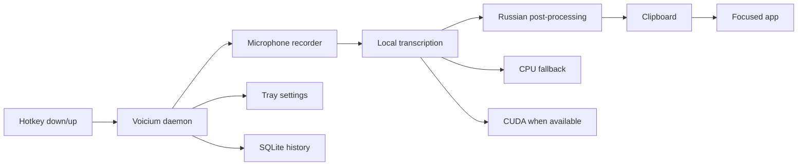

# Voicium

<p align="center">
  <b>Fast local-first Russian push-to-talk dictation for Ubuntu.</b>
</p>

<p align="center">
  Hold a hotkey, speak, release it, and get recognized text in your clipboard.
</p>

<p align="center">
  
  
  
  
  
</p>

<p align="center">
  
  
  
  
  
</p>

---

## Why Voicium

Voicium is a desktop productivity daemon for Russian dictation. It is built for a simple workflow:

1. Hold a configured push-to-talk key.
2. Speak Russian.
3. Release the key.
4. Text is transcribed locally.
5. Text is copied to clipboard immediately.

The project targets Ubuntu desktop users who want fast local dictation without sending audio to a cloud API.

## Features

- Local Russian speech recognition.
- Push-to-talk daemon with global `evdev` hotkey listener.
- Tray menu for runtime settings.
- Microphone selection from the tray menu.
- Runtime mode selection: `quality`, `fast`, `balanced`.
- Fast clipboard copy on Wayland and X11.
- Optional auto-paste infrastructure.
- SQLite transcription history.
- NVIDIA/CUDA detection with CPU fallback.
- GitLab CI for linting, tests, Python build, and `.deb` packaging.

## Architecture



## Technology Stack

| Area | Technology |
| --- | --- |
| Language | Python 3.12 |
| Dependency manager | `uv` |
| Lint / format | `ruff` |
| Tests | `pytest` |
| Audio capture | `ffmpeg` + PulseAudio/PipeWire source names |
| Hotkeys | `evdev` |
| Clipboard | `wl-copy`, `xclip`, `xsel` |
| Desktop integration | AppIndicator / AyatanaAppIndicator |
| Runtime service | `systemd --user` |
| History | SQLite |
| Packaging | `.deb` via `dpkg-deb` |

## Requirements

Target environment:

- Ubuntu 24.04 LTS;
- GNOME desktop;
- X11 or Wayland session;
- Python 3.12;
- `uv` for source builds;
- microphone available through PulseAudio/PipeWire;
- `input` device permissions for global hotkeys.

System packages commonly needed for local usage:

```bash
sudo apt update
sudo apt install -y \
  ffmpeg \
  pulseaudio-utils \
  wl-clipboard \
  xclip \
  libnotify-bin \
  gir1.2-gtk-3.0 \
  gir1.2-ayatanaappindicator3-0.1 \
  python3-gi
```

For push-to-talk access, add your user to the `input` group:

```bash
sudo usermod -aG input "$USER"
```

Log out and log back in after changing groups.

## Build From Source

Clone the repository and install dependencies:

```bash
git clone <repo-url> voicium
cd voicium
uv sync --frozen
```

Run quality checks:

```bash
uv run ruff check
uv run ruff format --check
uv run pytest
```

Build Python artifacts:

```bash
uv build
```

Build the Ubuntu `.deb` package:

```bash
./scripts/build-deb.sh
```

Artifacts are written to:

```text
dist/voicium-0.1.0.tar.gz
dist/voicium-0.1.0-py3-none-any.whl
dist/deb/voicium_0.1.0_all.deb
```

## Install The Package

Install or reinstall the generated Debian package:

```bash
sudo apt install --reinstall ./dist/deb/voicium_0.1.0_all.deb
```

The package installs:

| Path | Purpose |
| --- | --- |
| `/usr/bin/voicium` | CLI entrypoint |
| `/opt/voicium` | isolated Python runtime |
| `/usr/lib/systemd/user/voicium.service` | user daemon unit |
| `/usr/share/doc/voicium` | packaged documentation |

## First Run

Check your environment:

```bash
voicium healthcheck
```

Show current config:

```bash
voicium config show
```

Start the daemon in the foreground:

```bash
voicium daemon
```

Or run it as a user service:

```bash
systemctl --user daemon-reload
systemctl --user enable --now voicium.service
systemctl --user status voicium.service
```

View daemon logs:

```bash
journalctl --user -u voicium.service -n 100 --no-pager
```

## Usage

Default flow:

1. Start the daemon.
2. Open the tray menu.
3. Select the microphone.
4. Select the hotkey.
5. Select transcription mode.
6. Hold the hotkey and speak.
7. Release the hotkey.
8. Paste the recognized text from clipboard.

Manual control is also available:

```bash
voicium start
voicium stop
voicium status
```

Record and transcribe one short phrase from the terminal:

```bash
voicium record-transcribe --duration 5
```

Transcribe an existing WAV file:

```bash
voicium transcribe sample.wav --lang ru
```

## Tray Settings

The tray menu exposes runtime choices:

| Menu | What It Controls | Runtime Behavior |
| --- | --- | --- |
| `Hotkey` | push-to-talk key | applies without restarting the daemon |
| `Microphone` | PulseAudio/PipeWire input source | applies to the next recording |
| `Transcription Mode` | model/runtime profile | applies to the next transcription |
| `Paste` | auto-paste toggle | applies to the next transcription |

Selected items are shown as radio-style menu entries and are saved to:

```text
~/.config/voicium/config.toml
```

Example config:

```toml
[hotkey]
backend = "evdev"
key = "KEY_F8"

[audio]
input_device = "alsa_input.usb-Web-camera.analog-stereo"

[general]
language = "auto"

[transcription]
backend = "auto"
model_profile = "fast"
runtime_mode = "fast"

[paste]
auto_paste = false
fallback_to_clipboard = true
notify = true
```

## Runtime Modes

| Mode | Profile | Best For |
| --- | --- | --- |
| `quality` | whisper.cpp large-v3-turbo quantized model | best multilingual recognition quality |
| `fast` | whisper.cpp small quantized model | low latency and fast startup |
| `balanced` | whisper.cpp medium quantized model | middle ground |

`fast` is the default mode. It is designed to start quickly and avoid a heavy first-run download.
The default language is `auto`, so Russian speech stays Russian, English speech stays English, and
mixed dictation is handled by Whisper language detection instead of forced translation.

The legacy `russian` profile uses a large Hugging Face model and can take a long time to download
if selected or downloaded manually. It is not the default because it is optimized for Russian-only
dictation.

Download models:

```bash
voicium models download russian
voicium models download fast
voicium models download balanced
voicium models download accurate
```

Models are stored under:

```text
~/.local/share/voicium/models
```

## Clipboard Behavior

Voicium prioritizes not losing recognized text.

- On Wayland, it uses `wl-copy`.
- On X11, it uses `xclip` or `xsel`.
- Clipboard copy is optimized for low latency.
- If auto-paste is disabled or unavailable, text remains in clipboard.
- `auto_paste = false` by default, so Voicium only copies text to clipboard.
- When `auto_paste = true`, Voicium copies the text and then sends `Ctrl+V` to the active field.

## Developer Workflow

Common commands:

```bash
uv sync --frozen
uv run ruff check
uv run ruff format --check
uv run pytest
uv build
./scripts/build-deb.sh
```

Run the CLI from source:

```bash
uv run voicium --help
uv run voicium healthcheck
uv run voicium config show
```

## Troubleshooting

Healthcheck is the first diagnostic tool:

```bash
voicium healthcheck
```

List microphones known to PulseAudio/PipeWire:

```bash
pactl list sources
```

Check current default source:

```bash
pactl get-default-source
```

Check clipboard manually on X11:

```bash
printf 'hello' | xclip -selection clipboard
xclip -selection clipboard -o
```

Check NVIDIA state:

```bash
nvidia-smi
voicium backend select --backend auto
voicium backend cuda-smoke-test
```

## Documentation

- [Ubuntu MVP Plan](docs/ubuntu-mvp-plan.md)
- [Advanced Architecture](docs/ubuntu-advanced-architecture.md)
- [Release Candidate Guide](docs/ubuntu-release-candidate.md)

## Current Scope

Voicium is currently focused on the Ubuntu MVP path:

- Russian dictation;
- local transcription;
- tray-controlled runtime settings;
- `.deb` package;
- GNOME desktop integration;
- CPU fallback when CUDA is unavailable.

OpenAI-compatible enhancement is intentionally deferred for this release line.
